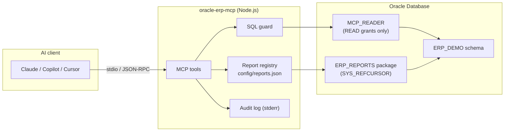

# Oracle ERP MCP Server

[](https://github.com/GokhanHepyetiker/oracle-erp-mcp/actions/workflows/ci.yml)


A secure, **read-only** [Model Context Protocol](https://modelcontextprotocol.io) server that lets AI assistants
(Claude, GitHub Copilot, Cursor, …) explore and report on **Oracle-based ERP databases**. Users can ask their ERP data business questions in plain language. They don't need to write SQL or file a ticket for a new report.

> *"Which waste paper supplier caused the highest moisture deductions last quarter?"*
> *"Show me the scrap rate per corrugator and tell me which product is the worst."*
> *"What is the current stock value of raw materials in warehouse W01?"*

The project ships with a dockerised **Oracle Database 23ai Free** instance pre-loaded with a realistic
ERP schema for a **paper & corrugated packaging manufacturer**: purchasing, weighbridge (truck scale) tickets, inventory, production work orders, and a curated PL/SQL report package.

---

## Features

- **5 MCP tools**: schema discovery, table description, guarded ad-hoc SQL, curated reports.
- **Defence-in-depth security**: a least-privilege DB user, `READ ONLY` transactions and a SQL guard (see [Security model](#security-model)).
- **Curated reports**: expose existing PL/SQL procedures that return a `SYS_REFCURSOR`. You add them through a JSON file, with no code changes.
- **LLM-friendly metadata**: table and column comments, primary keys and foreign keys help the model write correct joins.
- **Safe output**: row limits with truncation flags, query timeouts, and dates formatted without timezone shifts. LOB and BLOB values are handled safely.
- **Audit log**: every tool call is logged as JSON to `stderr` (tool, SQL, row count, duration, error).
- **No Oracle Client needed**: uses `node-oracledb` in Thin mode.
- **Tested**: unit tests with an in-memory MCP client, plus integration tests against a real Oracle database in CI.

## Architecture



## Tools

| Tool             | Description                                                                                   |
| ---------------- | --------------------------------------------------------------------------------------------- |
| `list_tables`    | Tables and views in the configured schema, with business descriptions and approx. row counts. |
| `describe_table` | Columns, types, nullability, comments, primary key and foreign keys.                          |
| `run_query`      | Executes a single guarded `SELECT` / `WITH` statement and returns JSON rows (row-limited).    |
| `list_reports`   | Lists curated reports and their parameters.                                                   |
| `run_report`     | Runs a curated report (PL/SQL procedure returning `SYS_REFCURSOR`) with validated parameters. |

All tools are annotated with `readOnlyHint: true`.

## Security model

An LLM must never be able to change ERP data, so the server applies several independent layers:

| # | Layer                       | What it does                                                                                                   |
| - | --------------------------- | -------------------------------------------------------------------------------------------------------------- |
| 1 | **Least-privilege user**    | `MCP_READER` only has `CREATE SESSION`, `READ` on ERP tables and `EXECUTE` on the report package. `READ` (unlike `SELECT`) also forbids `SELECT … FOR UPDATE` row locks. |
| 2 | **Read-only transaction**   | Every call runs inside `SET TRANSACTION READ ONLY` and is always rolled back.                                  |
| 3 | **SQL guard**               | Single statement only; must start with `SELECT`/`WITH`. Rejects DML/DDL/PL-SQL keywords, `DBMS_*`/`UTL_*` packages, URI types and DB links. Comments, string literals (incl. `q'[...]'`) and quoted identifiers are parsed so they can't be used to hide keywords. |
| 4 | **Curated report registry** | Only procedures listed in `config/reports.json` can be called; parameters are type-checked and always bound, never concatenated. |
| 5 | **Resource limits**         | Row limit (`MCP_MAX_ROWS`, hard cap 1000) and per-call timeout (`MCP_QUERY_TIMEOUT_MS`).                     |
| 6 | **Audit trail**             | JSON log line per tool call on `stderr`.                                                                       |

The integration tests bypass the SQL guard on purpose. They check that the database itself still rejects `DELETE`, `SELECT … FOR UPDATE` and DDL.

> [!IMPORTANT]
> Layer 1 is the real security boundary. In production, always connect with a dedicated read-only user, and preferably against a reporting replica or standby.

## Quick start

**Prerequisites:** Node.js ≥ 18, Docker.

```bash
git clone https://github.com/GokhanHepyetiker/oracle-erp-mcp.git
cd oracle-erp-mcp
npm install

# 1. Start Oracle 23ai Free with the demo ERP schema (first start takes a few minutes)
npm run db:up

# 2. Build the server
npm run build

# 3. Try it in the MCP Inspector
#    (set the variables from .env.example in your shell first)
npm run inspector
```

### Use it from VS Code (GitHub Copilot)

This repository already contains [`.vscode/mcp.json`](.vscode/mcp.json) for the demo database. Open the folder in VS Code, run `npm run build`, and then start the **oracle-erp** server from the MCP view. Its tools then become available in Copilot Chat (Agent mode).

### Use it from Claude Desktop

Add the server to `claude_desktop_config.json`:

```json
{
  "mcpServers": {
    "oracle-erp": {
      "command": "node",
      "args": ["/absolute/path/to/oracle-erp-mcp/dist/index.js"],
      "env": {
        "ORACLE_USER": "mcp_reader",
        "ORACLE_PASSWORD": "McpReader#2026",
        "ORACLE_CONNECT_STRING": "localhost:1521/FREEPDB1",
        "ORACLE_SCHEMA": "ERP_DEMO"
      }
    }
  }
}
```

## Configuration

| Variable                | Required | Default                 | Description                                              |
| ----------------------- | -------- | ----------------------- | -------------------------------------------------------- |
| `ORACLE_USER`           | yes      |                         | Read-only database user.                                 |
| `ORACLE_PASSWORD`       | yes      |                         | Password of that user.                                   |
| `ORACLE_CONNECT_STRING` | yes      |                         | Easy Connect string, e.g. `host:1521/SERVICE`.           |
| `ORACLE_SCHEMA`         | yes      |                         | Schema exposed to the assistant (e.g. your ERP schema).  |
| `MCP_MAX_ROWS`          | no       | `200`                   | Default and maximum rows returned per call (max `1000`). |
| `MCP_QUERY_TIMEOUT_MS`  | no       | `15000`                 | Round-trip timeout per database call.                    |
| `MCP_REPORTS_FILE`      | no       | `config/reports.json`   | Path to the curated report registry.                     |

## Adding your own reports

Any PL/SQL procedure whose **last** parameter is an `OUT SYS_REFCURSOR` can be exposed:

```sql
PROCEDURE open_orders (p_supplier_code IN VARCHAR2, p_result OUT SYS_REFCURSOR);
```

```json
{
  "name": "open_orders",
  "title": "Open purchase orders",
  "description": "Purchase orders that are not fully received yet.",
  "procedure": "ERP.PURCHASING_REPORTS.OPEN_ORDERS",
  "parameters": [
    { "name": "supplier_code", "type": "string", "description": "Optional supplier filter" }
  ]
}
```

Supported parameter types are `string`, `number` and `date` (passed as `YYYY-MM-DD`). Grant `EXECUTE` on the package to the read-only user.

## Demo data model

| Table                  | Content                                                                                     |
| ---------------------- | ------------------------------------------------------------------------------------------- |
| `SUPPLIERS`            | 15 domestic and import vendors (waste paper, pulp, chemicals, spare parts).                 |
| `ITEMS`                | Raw materials, chemicals, paper reels (testliner/fluting/kraftliner), corrugated boxes, spares. |
| `WAREHOUSES`           | Raw material yard, reel store, finished goods (2 sites), chemicals & spares.                |
| `PURCHASE_ORDERS`      | 420 orders in TRY / EUR / USD with realistic statuses.                                      |
| `PURCHASE_ORDER_LINES` | Lines with buyer-specific discount behaviour and received quantities.                       |
| `WEIGHBRIDGE_TICKETS`  | 900 truck-scale tickets with moisture/contamination deductions (`payable_kg`).              |
| `WORK_ORDERS`          | 320 paper machine (PM1/PM2) and corrugator (CORR1/CORR2) orders with scrap.                 |
| `STOCK_MOVEMENTS`      | ~3,000 receipts, production issues and receipts, and shipments.                             |

The data is generated deterministically (seeded `DBMS_RANDOM`) and contains patterns for the assistant to discover. For example, some suppliers deliver systematically wetter or more contaminated loads, and one corrugator produces more scrap than the other.

Curated reports in `ERP_DEMO.ERP_REPORTS`: `supplier_performance`, `waste_paper_quality`, `stock_balance`, `production_scrap`, `monthly_purchases`.

## Example questions

- *"List the tables and explain the data model in two sentences."*
- *"Using the waste paper quality report, which suppliers should we talk to about moisture?"*
- *"Compare the average discount each buyer achieved in 2026."*
- *"Which finished goods have the highest stock value in the Ankara hub?"*
- *"Show monthly TRY purchase spend for 2025 and describe the trend."*

## Development

```bash
npm run typecheck          # TypeScript strict mode
npm test                   # unit tests (no database needed)
npm run test:integration   # requires `npm run db:up`
npm run dev                # run from source with tsx
npm run db:down            # stop and remove the demo database
```

```
src/
  index.ts       entry point (stdio transport, graceful shutdown)
  server.ts      MCP tool definitions and audit logging
  db.ts          Oracle access layer (pool, read-only transactions, metadata)
  sqlGuard.ts    static SQL validation
  reports.ts     report registry, parameter validation, PL/SQL call builder
  config.ts      environment configuration (zod)
config/reports.json   curated report registry
docker/init/          schema, seed data, report package, read-only user
tests/                unit + integration tests (node:test)
```

## Roadmap

- MCP **resources** for schema documentation and **prompts** for common analyses
- Optional table/column allow-list and PII masking
- Streamable HTTP transport with authentication
- Export results as CSV/Excel

## License

[MIT](LICENSE) © Gökhan Hepyetiker
